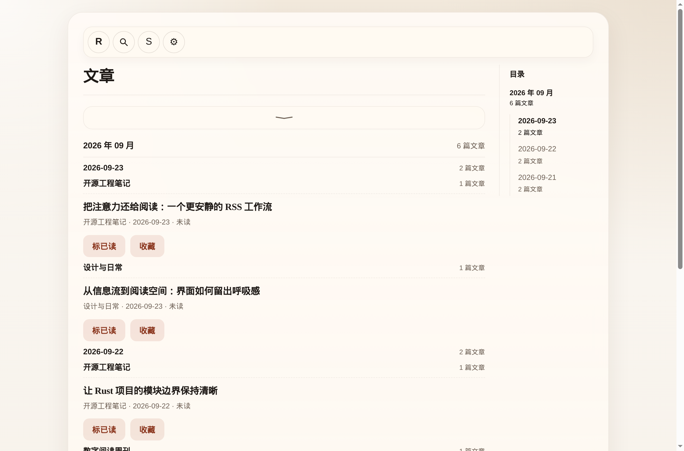

# RSS-Reader

> 打开订阅，直接阅读。

<p align="center">
  <a href="https://github.com/Develata/RSS-Reader/releases/latest"></a>
  <a href="https://github.com/Develata/RSS-Reader/actions/workflows/ci.yml?query=branch%3Amain"></a>
  <a href="./LICENSE"></a>
  <a href="#30-秒开始阅读"></a>
</p>



_Web 版实际界面；订阅与文章使用演示数据。_

RSS-Reader 是用 Rust 和 Dioxus 构建的本地优先 RSS 阅读器。它把订阅、刷新、筛选和阅读放在一条简短的使用路径上；桌面、Web、Android 和 CLI 复用同一套核心能力。文章库留在当前设备，配置可以通过 JSON、OPML 或可选的 WebDAV 迁移。

[下载最新版本](https://github.com/Develata/RSS-Reader/releases/latest) · [发布说明](https://github.com/Develata/RSS-Reader/releases) · [English](./docs/README.en.md) · [文档](./docs/README.md) · [报告问题](https://github.com/Develata/RSS-Reader/issues)

## 30 秒开始阅读

1. 在 [Releases](https://github.com/Develata/RSS-Reader/releases/latest) 选择适合设备的附件：

   | 设备 | 桌面 / 安装附件 | 开始使用 |
   | --- | --- | --- |
   | Windows x64 | `RSS-Reader-windows-x86_64.zip` | 解压到可写目录，运行 `RSS-Reader.exe`；系统需有 WebView2 Runtime |
   | Linux x64 | `RSS-Reader-linux-x86_64.deb` | 在满足包内依赖的系统安装；数据写入当前用户的 XDG 数据目录 |
   | macOS Intel / Apple Silicon | `RSS-Reader-macos-x86_64.tar.gz` / `RSS-Reader-macos-aarch64.tar.gz` | 解压到可写目录，打开 `RSS-Reader.app` |
   | Android ARM64 | `RSS-Reader-android-arm64-v8a-release.apk` | 安装 APK；AAB 是应用商店产物，不能直接安装 |
   | Web | `RSS-Reader-web.tar.gz` | 静态站点包；需要受保护的登录和跨域 feed 代抓时使用 [Web 部署指南](./docs/deployment/web.md) |

2. 打开应用，点顶栏的订阅图标（RSS 波纹）进入订阅页，输入 RSS / Atom 地址并添加订阅。
3. 点击 **R**（Read / Home）查看文章；已在首页时再次点击 **R** 可手动刷新全部订阅。

上表按已发布的 `v0.1.19` 产物核对；具体变更和验收范围见[本版 Release 说明](https://github.com/Develata/RSS-Reader/releases/tag/v0.1.19)。Android 已有正式签名 APK / AAB，但系统返回、长按选择、下拉刷新和图片手势尚未完成真机验收；macOS 也尚未完成实机交互验收。

**Linux 安装包：** `v0.1.17` 已修复旧版 `.deb` 的普通用户写权限和动态库依赖缺失问题。本次 `v0.1.19` 发布流水线也在 Ubuntu 24.04 安装包后，以普通用户在 Xvfb 下两次启动，验证中文与空格路径中的数据库创建和复用。包的最低库版本来自 Ubuntu 24.04 构建环境；其它发行版应先核对 `.deb` 的 `Depends`，不能据此推定旧版发行版兼容。

## 日常使用

- **导航与刷新：** 展开导航后可使用 R。从阅读页或其他页面点击 R 只返回全部文章页；已在首页再次点击才刷新全部订阅。连续触发复用进行中的刷新，手机首页还可在滚动到顶部后下拉刷新。
- **搜索与筛选：** 放大镜展开标题搜索框，窄导航内换行使用完整宽度；Enter 搜索，Esc 收起。文章列表可按来源、未读、收藏等条件筛选；来源名完整显示，并以弱化数字显示该订阅全部未读数（含 0，不受搜索或归档筛选影响）；多页时分页按钮保持可触达。
- **阅读：** 左上角返回；可切换已读和收藏、跳转相邻文章、点击正文图片放大。正文保留原生文字选择与复制行为。刷新不会突然替换正在看的正文。顶部依次显示订阅名、作者（如有）、发布时间及“打开原文”；Web 新标签、桌面系统浏览器、Android 外部链接处理器打开原文，保留当前阅读页。阅读时间、卡片日期、日期分组与订阅刷新时间使用设备本地时区，完整时间标明数值偏移；时区不可用时回退并标注 UTC。
- **设置与迁移：** 滑杆图标进入设置，支持内置主题和自定义 CSS；JSON / OPML 用于配置交换，可选 WebDAV 同步配置。
- **继续阅读：** 本次运行内返回列表会恢复分页及文章所在位置，短暂标示刚打开的文章；重新打开文章会恢复阅读位置。位置在点击操作、快捷键切文或前进／返回时采集，不随滚动反复扫描正文。重启应用或刷新 Web 页面后清除，不影响已读状态。
- **收起导航：** 顶栏最右侧的窄箭头可向左收起 Read、搜索、订阅和设置，只留下展开按钮；手机与桌面均可用，同次运行中切页保持状态。
- **自动化：** `rssr-cli` 支持订阅管理、刷新、设置和配置导入导出；运行 `cargo run --locked -p rssr-cli -- --help` 查看命令。

Reader 快捷键：`M` 切换已读、`F` 切换收藏、`←` / `→` 跳转上一篇 / 下一篇未读。搜索框内、输入法组词期间与带 Ctrl / Cmd 等修饰键的原生编辑操作不会触发阅读快捷键或位置采集。

## 本地数据与边界

Linux `/usr/bin` 安装版在 `$XDG_DATA_HOME/rss-reader/`（未设置时为 `~/.local/share/rss-reader/`）保存数据；Windows、macOS 和 Linux 便携版仍在可执行文件同目录的 `RSS-Reader/` 保存数据。目录中包含 `rss-reader.db`（索引）、`rss-reader-content.db`（正文），还可能有 `shell-prefs.json`。SQLite 的 `-wal`、`-shm` 是正常附属文件；备份时先退出应用，再复制整个目录。旧版如曾以管理员身份在 `/usr/bin/RSS-Reader/` 产生数据，升级后不会自动迁移；请在应用退出后备份并由管理员将完整目录复制到新位置、改为当前用户所有。Android 使用应用沙箱内的本地 SQLite；卸载应用会清除本地数据，请先导出配置。Web 将状态序列化保存到当前浏览器的 `localStorage`，它与桌面数据库互不共享；清除站点数据也会清除本地文章库。

RSS-Reader 缓存 feed 提供的正文，不主动抓取原网站补全全文。桌面端和 Android 会尽量把正文图片本地化；Web 受浏览器 CORS 限制。JSON / OPML / WebDAV 交换的是订阅与设置，**不是文章库、已读状态或收藏的跨设备同步**。直接运行静态 Web 包时，某些 feed 会因 CORS 无法刷新；`rssr-web` 提供带登录的同源 `/feed-proxy`，见 [Web 部署指南](./docs/deployment/web.md)。

Web 需通过 HTTPS（本机可用 localhost）在支持 Web Locks 的浏览器中运行。同一站点的多个新版标签页可安全修改已读与收藏；存储失败会报错并保留此前提交的数据。升级后请重新加载所有旧标签页。页面不会自动替换另一标签正在看的正文，返回列表或重新加载时读取最新数据；详见[用户指南](./docs/user-guide.md)。

项目的长期范围是订阅、阅读、基本设置和基础配置交换；不做推荐流、社交平台或 AI 内容加工。设计依据见[功能设计哲学](./docs/design/functional-design-philosophy.md)。

## 从源码运行与验证

需要 Rust 稳定版；Web 开发还需要 `wasm32-unknown-unknown` target 与 Dioxus CLI `0.7.9`。

```bash
# 桌面端
cargo run --locked -p rssr-app

# Web 开发
rustup target add wasm32-unknown-unknown
cargo install dioxus-cli --version 0.7.9 --locked
dx serve --platform web --package rssr-app

# CLI
cargo run --locked -p rssr-cli -- --help
```

提交前的基础检查：

```bash
cargo fmt --all --check
cargo clippy --locked --workspace --all-targets -- -D warnings
cargo test --locked --workspace
cargo check --locked -p rssr-app --target wasm32-unknown-unknown
```

页面或移动端交互改动还应按环境补充 Android target、Web/原生 UI 验收。CI 分模块并行执行 Rust 检查、Web 浏览器契约及 Android 构建；每条路径与环境限制见[主线验证矩阵](./docs/testing/mainline-validation-matrix.md)。编译通过不等于 Android 或 macOS 实机已验收。

## 发布与文档

- [使用指南](./docs/user-guide.md)：订阅、搜索、阅读、主题、WebDAV 和本地备份。
- [Web / Docker 部署与登录配置](./docs/deployment/web.md)：GHCR、Compose、生产环境、`/feed-proxy`。
- [Android 构建与验收状态](./docs/roadmaps/android-release-roadmap.md)：本地 APK、签名与待测设备行为。
- [文档索引](./docs/README.md)：设计、测试、交接记录。
- [贡献说明](./CONTRIBUTING.md) · [MIT License](./LICENSE)。

常见问题：Windows 运行通常需要 WebView2 Runtime；Web 直连 feed 受目标站点 CORS 策略影响；CLI 附件面向脚本和高级用户，普通阅读只需应用附件。若 Android 安装遇到签名不匹配，先确认当前包与已安装版本的签名身份；卸载前务必导出配置，避免丢失本地数据。

### 按筛选批量已读

文章页可预览并确认将当前筛选下所有分页的未读文章标为已读；保留搜索、来源、收藏和归档条件。匹配集合变化时要求重新确认。CLI 使用 `mark-read --all` 或 `mark-read --feed-id <id>` 预览，添加 `--yes` 执行。

### 网站首页订阅

新增订阅支持网站首页与 RSS/Atom URL。首页声明单个 feed 时自动添加，多个时选择；没有声明时只探测 `/feed`、`/rss.xml`、`/atom.xml`、`/index.xml` 四个路径。CLI 同样支持发现；多个候选会列出地址并以非零退出码结束，需选定 URL 后重试。`--skip-refresh` 仍验证并解析订阅地址，但不导入文章。

### 刷新新增计数

手动刷新显示实际新增篇数，重复刷新或仅内容更新显示“没有新文章”。部分失败同时显示成功订阅的新增数与失败信息；全部失败显示错误。成功反馈3秒、错误6秒。阅读页仍只显示图标反馈，自动刷新保持静默，CLI显示每个订阅和合计新增数。

添加订阅与刷新都限制单次响应为 8 MiB（解压后字节及转码后的 UTF-8 文本），超限会报告失败并保留既有文章。Web 重复取得完全相同的正文时跳过正文存储写入；大量正文实际变化时仍有整片存储成本。
