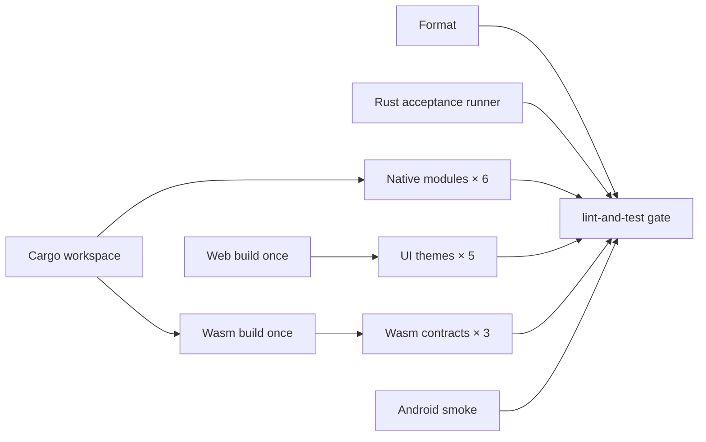

# 主线验证矩阵

这份文档把当前主线的自动化测试、手工 smoke、环境限制判断口径收拢成一套长期维护的验证流程。

它回答 3 个问题：

- 当前主线每个核心能力应该看哪些自动化入口
- 哪些能力即使自动化通过，仍然必须做手工 smoke
- 某项失败时，应该先判断为代码回归，还是环境限制

## 使用方式

建议按下面顺序执行主线验证：

1. 跑自动化基础口
2. 对照本矩阵判断是否还有必做 smoke
3. 遇到失败时，先查 [环境限制索引](./environment-limitations.md)
4. 将本次验证结果回写到相应 handoff

## 自动化基础口

- `cargo test --workspace`
- `cargo check -p rssr-app --target wasm32-unknown-unknown`
- `cargo check -p rssr-app --target aarch64-linux-android`
- `cargo test -p rssr-web`

说明：

- 如果 `cargo test --workspace` 只剩 `test_webdav_local_roundtrip` 在受限环境中失败，不应直接判定为功能回归；先查 [环境限制索引](./environment-limitations.md)

## GitHub CI 并发矩阵

[ci.yml](../../.github/workflows/ci.yml) 每次 main push / PR（或手动触发）均覆盖所有 workspace crate。模块列表及 `rssr-infra` 的 `wasm_*_contract_harness` 列表直接来自锁定依赖的 `cargo metadata`，wasm-bindgen 工具版本读取 `Cargo.lock`，不再手工维护第二份列表 / 版本。没有额外的路径选测规则；避免共享代码或新 crate 被遗漏。业务依赖方向仍由 Cargo 决定，独立 runner 只拆分验收执行。

| Job / matrix | 自动验收 | 并发上限 / 超时 |
| --- | --- | --- |
| `workspace`、`format` | 生成完整模块列表；`cargo fmt --all --check` | 独立运行，各 10 分钟 |
| `test-tools` | actionlint 1.7.12（官方校验和验证下载）；std-only Rust wasm runner 的 rustfmt、Clippy、单测及子进程隔离；Linux `.deb` 版本与动态库依赖元数据适配测试 | 独立运行，10 分钟 |
| `native-module` / 6 crates | `cargo clippy --locked -p <crate> --all-targets -- -D warnings`；`cargo test --locked -p <crate>`（含 doc tests）；CLI help | 4 / 每模块 35 分钟 |
| `web-smoke` | wasm target Clippy（`-D warnings`，覆盖 rssr-app 及路径依赖的 `cfg(wasm32)` 分支）、Dioxus 0.7.9 release bundle，上传实际 public 包 | 40 分钟 |
| `web-ui` / default + 4 builtin themes | 下载同一次 Web 构建，既有 small viewport smoke 的 360×800 / 1280×800、真实请求、输入、选择、图片与设置验收 | 3 / 每主题 15 分钟 |
| `wasm-contract-build` | 一个锁定依赖的 Cargo 调用准备全部 harness，上传精确产物；预热 wasm-bindgen 工具缓存 | 35 分钟 |
| `wasm-browser-contract` / 3 harnesses | 下载同一批产物，分别运行 refresh / subscription / config exchange 浏览器契约，不再运行 Cargo | 3 / 每 harness 15 分钟 |
| `android-smoke` | 锁定 NDK / ARM64 check、bundle、APK 资源 / ABI / version 断言；`~/.gradle` 按 dx 版本与 Android 输入缓存 | 50 分钟 |
| `lint-and-test` | 汇总所有 jobs，只有全部 success 才通过；失败、取消、意外跳过均拒绝 | 5 分钟 |

- 同一 PR / ref 的旧 CI run 会被新 run 取消；不同 PR 不共用 concurrency group。每个 matrix 使用 `fail-fast: false`，保留其他模块的完整结果。
- 上表上限是各 matrix 的上限，不是整个 workflow 的全局配额；实际并发还取决于 GitHub runner 配额。
- Rust cache 按 native crate / Web / Android / wasm 构建职责区分，只有 UI crate 安装 GTK / WebKit。UI job 不重复编译 Web，wasm job 不重复编译契约；不上传浏览器 profile。Web / wasm 包保留 3 天，UI 断言 / 日志 / 截图保留 7 天。
- wasm-bindgen / Dioxus 工具在独立安装目录按 OS / 架构 / 精确版本缓存，命中后仍核对实际版本；不覆盖全局 Cargo 安装登记。wasm 构建 job 先预热工具缓存，后续三个 job 通常直接恢复，缓存不可用时仍允许安装。Chrome 按解析出的精确版本缓存，只有 wasm job 安装匹配的 ChromeDriver；CDP UI job 只用 Chrome。冷缓存、artifact 传输和远端缓存服务耗时仍需真实 run 测量，编译次数减少不等于已证明总耗时同比下降。
- 保留原 `lint-and-test` 检查名作为最终汇总，不自动修改仓库 branch protection / 发布权限。新增工作流配置仍需提交后由真实 GitHub run 验证，不能把本地检查视为已部署 CI。
- 并发语义参考 [GitHub matrix](https://docs.github.com/en/actions/how-tos/write-workflows/choose-what-workflows-do/run-job-variations) 与 [workflow concurrency](https://docs.github.com/en/actions/how-tos/write-workflows/choose-when-workflows-run/control-workflow-concurrency)。

本地可用上表 `-p <crate>` 命令分模块定位，完整检查仍保留 `cargo test --locked --workspace` 和 `cargo clippy --locked --workspace --all-targets -- -D warnings`。在同一工作目录启动多个 Cargo 通常会争用 target 锁；CI 的并发来自独立 runner，而不是后台启动多个争用同一构建目录的进程。

wasm 验收规则由现有 Rust harness 持有，执行适配位于 `scripts/wasm_contract_runner.rs`（std-only，直接 rustc 编译，无产品依赖和新 crate）。Cargo target runner 提供本次编译的真实 artifact，支持自定义 `CARGO_TARGET_DIR`；每次运行使用独立 webdriver 配置和 profile，并保留测试参数与失败退出码。薄 Shell 只保留环境预检、编译工具和转发。配置文件路径使用 wasm-bindgen 0.2.126 的 [`WASM_BINDGEN_TEST_WEBDRIVER_JSON` 接口](https://github.com/wasm-bindgen/wasm-bindgen/blob/0.2.126/crates/cli/src/wasm_bindgen_test_runner/headless.rs#L129)；默认 test / driver 超时为 60 / 15 秒，允许现有环境变量覆盖。真实浏览器结果不能由 stub runner 或 `--no-run` 编译替代。

CI 使用 `bash scripts/run_wasm_contract_harness.sh --prepare <新目录> <harness...>` 准备产物，随后独立 job 使用 `--prebuilt <下载目录> <harness>` 执行。交付目录放在 `RUNNER_TEMP`，不进入 Cargo target 缓存。准备阶段通过 Cargo runner 收集本次真实路径；成功且集合完整后才发布正式 manifest，已有目录、重复或缺失产物均拒绝。准备成功只说明构建产物齐全，不能冒充浏览器契约通过。原单模块入口和本地多 harness 构建后运行的接口不变。

Cargo JSON / TOML 事实解析、GitHub `needs` JSON 摘要仍使用短 Python 适配。没有为几行解析新增 Rust crate 或手写通用解析器；构建产物选择、交付检查与执行隔离留在既有 Rust 工具。

### GitHub Actions 版本维护

2026-09-22 联网核对官方 releases、major ref 与 `action.yml` 后使用下列稳定 major。表中精确版是查询快照；浮动 major 后续可能更新，不能视为永久固定版本。

| Action | 使用 ref | 查询时最新稳定版 |
| --- | --- | --- |
| actions/checkout | v7 | [v7.0.1](https://github.com/actions/checkout/releases/tag/v7.0.1) |
| actions/setup-node | v7 | [v7.0.0](https://github.com/actions/setup-node/releases/tag/v7.0.0) |
| actions/setup-java | v6 | [v6.0.1](https://github.com/actions/setup-java/releases/tag/v6.0.1) |
| actions/cache | v6 | [v6.1.0](https://github.com/actions/cache/releases/tag/v6.1.0) |
| actions/upload-artifact | v7 | [v7.0.1](https://github.com/actions/upload-artifact/releases/tag/v7.0.1) |
| actions/download-artifact | v8 | [v8.0.1](https://github.com/actions/download-artifact/releases/tag/v8.0.1) |
| android-actions/setup-android | v4 | [v4.0.4](https://github.com/android-actions/setup-android/releases/tag/v4.0.4) |
| docker/setup-buildx-action | v4 | [v4.4.1](https://github.com/docker/setup-buildx-action/releases/tag/v4.4.1) |
| docker/login-action | v4 | [v4.6.0](https://github.com/docker/login-action/releases/tag/v4.6.0) |
| docker/metadata-action | v6 | [v6.2.0](https://github.com/docker/metadata-action/releases/tag/v6.2.0) |
| docker/build-push-action | v7 | [v7.4.0](https://github.com/docker/build-push-action/releases/tag/v7.4.0) |
| Swatinem/rust-cache | v2 | [v2.9.2](https://github.com/Swatinem/rust-cache/releases/tag/v2.9.2) |
| softprops/action-gh-release | v3 | [v3.0.3](https://github.com/softprops/action-gh-release/releases/tag/v3.0.3) |

以上 JavaScript Actions 均原生使用 Node 24，已移除强制 runtime 的过渡环境变量。`dtolnay/rust-toolchain@stable` 为 composite，继续跟踪 stable。setup-node 安装的 Node 22 与 Action runtime 是不同层；浏览器脚本无 npm 安装步骤，显式关闭自动 package-manager cache。Dioxus / wasm-bindgen / Android NDK 仍按项目兼容版本锁定，不随 Actions 主版本升级产品依赖。

[Dependabot](../../.github/dependabot.yml) 每周检查 github-actions 并合并为更新 PR，仍需验收后合并，不自动发布。Release 对 push tag / 手动同 tag 使用同一个 concurrency 身份，不中断正在发布的 run；Docker tag run 同样保留执行。各 job 有有限超时，Release 构建使用 `--locked`，Android 选择精确 NDK 路径。上传、签名、发布权限和触发边界保持原有契约。

## 主线最小验证矩阵

| 能力项 | 自动化入口 | 是否需要手工 smoke | 是否受环境限制 | 通过标准 |
|---|---|---|---|---|
| add/remove | `cargo test -p rssr-application`；`cargo test -p rssr-infra --test test_application_refresh_store_adapter`；`cargo test -p rssr-infra --test test_subscription_contract_harness`；`bash scripts/run_wasm_subscription_contract_harness.sh`；`cargo check -p rssr-cli` | 是 | 中 | URL 可添加；删除后列表与 app state 保持一致；browser persisted-state 与 sqlite contract 保持一致；无异常报错 |
| refresh | `cargo test -p rssr-application`；`cargo test -p rssr-infra --test test_feed_refresh_flow`；`cargo test -p rssr-infra --test test_application_refresh_store_adapter`；`bash scripts/run_wasm_refresh_contract_harness.sh` | 是 | 中 | single / all 都可完成；成功、失败、not modified 语义正确；browser refresh store target/commit 语义正确；不产生异常重复写入 |
| CLI refresh 参数 | `cargo test --locked -p rssr-cli --test test_stdout_contract` | 否 | 低 | `--all` / `--feed-id` 恰选其一；无目标或双目标在打开数据库前以非零码退出 |
| Linux `.deb` 安装 | `bash scripts/test_prepare_linux_deb.sh`；release job 中 `dpkg-deb -f ... Depends`、普通用户 Xvfb 双启动 | 是 | 高 | 拒绝输入文件的路径别名/硬链接/符号链接及目录作为输出；tag 版本、运行时依赖字段、用户 XDG 路径、两个数据库与重启后数据复用均成立；本地工具测试不能替代新 tag 的安装验收 |
| Web feed 代理边界 | `cargo test --locked -p rssr-web proxy::tests`；`bash scripts/run_rssr_web_proxy_feed_smoke.sh` | 是 | 中 | 本地 / 内网 / IPv4 映射 IPv6 地址拒绝；隔离子进程设置环境代理后仍直连固定 IP；DNS 有上限且重定向逐跳重新验证 |
| Web 登录回跳 | `cargo test --locked -p rssr-web auth::tests` | 否 | 低 | 回跳限定同源路径；拒绝会被浏览器归一化为外站地址的反斜杠/控制字符，输出可用作 Location header |
| SQLite 路径与内存库分类 | `cargo test --locked -p rssr-infra --lib db::` | 否 | 低 | 内存 URI 的查询参数正确解码；文件名中的 `mode=memory` 不改变文件库分类，索引/正文文件分离并启用 WAL；显式文件路径不当作 URL 解析 |
| config/exchange | `cargo test -p rssr-application`；`cargo test -p rssr-infra --test test_config_package_codec`；`cargo test -p rssr-infra --test test_config_package_io`；`cargo test -p rssr-infra --test test_opml_interop`；`cargo test -p rssr-infra --test test_config_exchange_contract_harness`；`bash scripts/run_wasm_config_exchange_contract_harness.sh` | 是 | 中 | JSON / OPML roundtrip 可用；损坏或非法配置被拒绝；导入后订阅与设置恢复符合预期；browser persisted-state 与 sqlite contract 保持一致 |
| reader rendering | `cargo test -p rssr-app`；`cargo check -p rssr-app --target wasm32-unknown-unknown` | 是 | 中 | 阅读页优先展示完整 HTML；HTML-like fallback 不再被原样显示标签；内容经过清洗 |
| web startup | `cargo check -p rssr-app --target wasm32-unknown-unknown`；`cargo test -p rssr-web` | 是 | 中 | 首屏可交互；无黑屏、无页面无响应；主要路由切换正常；Console 无新的 panic / 死循环 |
| paste/input | `rssr-app` Feeds session 测试；既有 small viewport smoke 的真实键盘输入 / Enter / pending 场景 | 是 | 中 | 新增订阅可聚焦、提交；重复提交去重、期间新输入保留；原生粘贴及平台输入法继续实机补查 |
| settings save | `cargo test -p rssr-infra --test test_settings_repository`；`cargo test -p rssr-infra --test test_config_package_codec` | 是 | 低 | 非法边界值被拒绝；合法值可保存并持久化；刷新或重启后仍保持 |
| remote pull cleanup | `cargo test -p rssr-infra --test test_webdav_local_roundtrip`；`cargo test -p rssr-infra --test test_config_package_io` | 是 | 高 | 远端删除的 feed 会从本地移除；相关 entries 与 app state 被清理 |

## 推荐的主线验证顺序

### 1. 自动化基础口

- `cargo test --workspace`
- `cargo check -p rssr-app --target wasm32-unknown-unknown`
- `cargo check -p rssr-app --target aarch64-linux-android`
- `cargo test -p rssr-web`

### 2. 平台最小 smoke

- Desktop：
  - add/remove
  - refresh
  - reader rendering
  - paste/input
  - settings save
- Web：
  - web startup
  - add/remove
  - refresh
  - reader rendering
  - config/exchange
- CLI：
  - add/remove
  - refresh
  - config/exchange
  - settings save

### 3. 结果记录

建议每次主线验证至少记录：

- 日期
- 执行环境
- 自动化基础口结果
- `env-limited` 项
- Desktop / Web / CLI smoke 结果
- 关联 handoff 或测试文档

## 参考入口

- [发布前 UI 回归清单](./release-ui-regression-checklist.md)
- [手工回归测试清单](./manual-regression.md)
- [Headless 重构视觉等价验收](./headless-refactor-equivalence.md)
- [最近交接记录](../handoffs/README.md)
